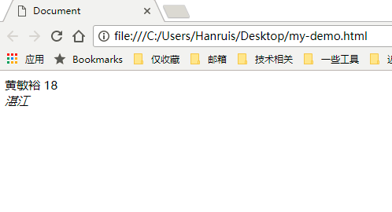
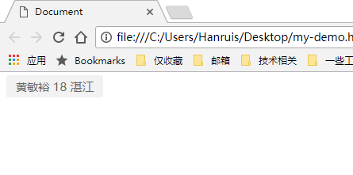
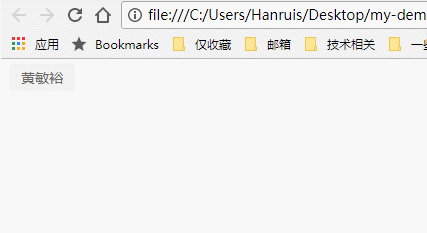

## 前端技术基本介绍（for hr 了解使用）


### 什么是前端？

简单来说，就是做网页的。平时上网，在浏览器上看到的『天猫』，『淘宝』这些（注意是看到的），就是前端做的。


### 那前端和后端不是都是做网站的么，有什么不同？

是的，都是做网站的。不同点在于职责不一样。

想一下，在『天猫』上，进入个人中心，你可以看到自己的个人信息。但是它具体是怎么展现在你眼前的呢？

最直观的，程序员，把你的个人信息，在『天猫』上，通过网页的形式展现出来。（当然，如果在 App 上看自己的个人信息，那就是通过 App 的界面展现）。通常意义上，做**网页**这个工作的，叫做前端。做 App 的，分成 IOS 和安卓，两者一般统称为『客户端』；

在你的个人信息界面，里面可以修改个人信息。有没有想过，这些个人信息放在哪里？没错，就是平常我们听到的服务器上。程序员需要将你修改的个人信息，通过校验（比如非法的手机号码是不允许的），然后保存到服务器上。通常意义上，做这个工作的，叫做后端。

当然，实际上的职责，会根据公司的情况，会有更加详细的分工。比如前端，在腾讯还会分成重构，和 js 。而后端，在一些比较大的公司，会分为普通的后端，DBA（数据库管理员），SA（服务器运维）

但是，现在，你只要了解，什么是前端，什么是后端。


### 可是，JD 中 css，html， vue 等一堆名词，还是看不懂。

请放松，一口吃不成胖子。我们现在来简单介绍下，作为一名「前端」程序员，需要学习什么技能。这里以「个人信息」页为例子，介绍 css，html， javascript

思考下，前端程序员是如何在浏览器上，展示你的个人主页的？也就是说，前端程序员，需要告诉浏览器什么，or 给浏览器什么内容，才能显示辣么华丽的页面？（当然，你或许会问，为什么浏览器收到这些信息就懂得这样展现，这个一个高级的话题，先暂且放下）

这里，我们已经知道一个事情，就是前端程序员，需要告诉 or 给浏览器一些东西，才能显示你的个人信息。注意，这不是废话。因为你已经明白注意到一个事情，浏览器不是无缘故的就显示你的信息。

继续，前端程序员，告诉了浏览器什么呢？

告诉了浏览器『个人信息』页的 html， css ，javascript（简称 js）。没错，这就经常在 JD 上看到的：「熟悉 html，css， javascript.......」

或许你会觉得，这我知道，可是「html，css， javascript.」分别是什么？有什么用？

先放下这几个名词，来讲讲，浏览器显示「个人信页」的过程是怎么样的


1. 首先需要有你的个人信息，并按照一定的规则编写，比如下面这样。备注下面只是示例，方便理解，实际中的写代码的时候，不这样子。
    ```html
    <document>
      <name>黄敏裕</name>       <-- 告诉这里有个 name 的标记，内容是「黄敏裕」
      <age>18</age>            <-- 告诉这里有个 age 的标记，内容是 「18」
      <address>湛江</address>  <-- 告诉这里有个 address 的标记，内容是 「湛江」
    </document>
    ```
     

2. 很好，个人信息已经显示出来了。但是，有点丑  ╮(╯▽╰)╭：浏览器不知道这段信息，要显示成怎么样子：字体大小，颜色，要不要换行，行距多少。so，我想你应该知道了，浏览器需要一份「样式配置」，来**更好的展示**个人信息。示例如下，仅仅是示例，实际上的网页开发，会比这个复杂很多：
    ```css
    document{                     <-- 表明这个配置是给 document 标记的
      background-color: #f2f2f2;  <-- 配置 document 背景颜色
      border-radius: 2px;         <-- 配置 document 圆角
      color: #666;                <-- 配置 document 文字颜色
      padding: 4px 12px;          <-- 配置 document 内部边距
    }
    name{
      line-height: 18px;
      font-size: 14px;
    }
    address{
      display: inline-block;
      font-style: normal;
    }
    // 注意，这份「配置」并不是必须的，浏览器自身会有一份默认的配置，来应对没有「配置」的情况
    ```
    


3. 现在网页看起来，是比较丰富了：有了信息，有了良好的外观。不过好像差点什么，比如淘宝首页，很多图片在轮播，一张一张的过去，循环播放；点击不同的 tab 会显示不同的内容。这是怎么做到的？

   ​

   聪明的你，应该想到了，可以通过一份「代码」，来告诉浏览器：哪些标记，有怎么样的效果，对于哪些行为，有什么反应。下面看示例：（实际上 js 不是这样写的）
    ```
      - getNameFromeDocument   <-- 找到 name 标记
      - add event click : hide 「age」 & 「address」  <-- 添加点击事件，点击 name 之后，隐藏标记 age 和 address
    ```
   

到这里，html，css 和 javascript 的意思就很明白了。（注意，实际上经过多年的发展，它们也有了很多的变化，所以这仅当作基础理解，但并不是他们的全部）
	- html       <--> 结构
	- css        <--> 样式配置
	- javascript <--> 代码，实现交互


### 名词介绍：jQuery，vue，angular，react

如果感兴趣的话，在了解上面概念之前，先了解「库」 & 「框架」的概念。当然，也可以直接去看对应的介绍

「库」，通俗的理解就是「工具」or 「工具箱」[严谨的介绍](https://www.quora.com/What-does-library-mean-in-the-case-of-programming-languages)。比如使用 excel 计算工资 & 工资总支出，我们可以设定计算公式，每次只要将数据黏贴到特定区域，就会自动重新计算。更通俗的介绍，比如在建房子的时候，需要锤子，铲子，电钻等工具，会放在一个工具箱里面，而不是每个人都自己造一把 or 买一把。同样的，在编程中，有很多通用类似的东西，能够提取出来，给到大家使用，避免重复劳动。所以，这里的「工具」or 「工具箱」，就对应着编程中的「库」

「框架」，通俗的理解就是「通用的解决方案」，不同的框架，要解决的问题不同。比如建设公寓的楼房结构和CBD高楼的结构，是不一样的，虽然都是架子，都是在上面加东西，但实际上它们要面对的问题类型，但不完全一样。

看到这里，相信你明白，「库」是你在使用它，而「框架」则是在它的设定范围做一些事情。这也是两者之间最大的不同。

接下来，具体介绍标题的几个名词

- **jQuery**：库，一套「工具箱」，方便前端程序员开发，提高效率的。相当于前端程序员的「锤子」「电钻」
- **vue，angular，react**：前端最近今年的主流框架「框架」（MMVM 类型的框架）。如果使用在浏览器上使用过「有道云笔记」，「网易云音乐」（老板，广告费什么时候发~~），有没有留意到，这些网站都非常复杂，做的和电脑软件一样。这里 vue ，angular， react 就是为了前端程序员，在网页中做复杂项目时候使用的，可以在这些框架下，比较「高」效率的工作。注意，vuejs，angularjs， reactjs ，表示的是同一样东西。（后缀的 js 表示 javascript）

下面，简单介绍下 vue， angular， react 的背景：

- vue： 华人开发者开发的（华人骄傲），用得人目前和 angular 差不多，但国内情况，vue 闭 angular 火。
- angular： 谷歌出品，用的人也比较多
- react： facebook 出品，很火，用的人很多。


### 其他经常在 JD 上出现的词汇

- **浏览器兼容性**：浏览器有搜狗，360，qq，还有 chrome，火狐，ie。手机上的浏览器还分安卓和 ios ，安卓系统还有不同的版本，这些版本里面的自带浏览器都不尽相同。所以，一个优秀的工程师要能够有这方面的经验 or 知道如何解决这方面的问题，让网页在上面在大部分的浏览器上都表现一样。
- **Ajax**：不用太关注，这年代基本是个前端都都会。(有机会再详细介绍，这个属于比较细)
- **性能优化**：简单的说，就是网页打开要快，要流畅。有优化网页经验的人，是做的算比较好的（要么公司规模大，or 的网页复杂，对这方面有要求，要么本身有能力和时间去做这个）。
- **Web标准、易用性、浏览器端原理**：一般是 JD 装逼用的，实际上有当然是好，但绝大多数人不会关注到这方面的内容。
- **高保真、切图** ：将设计稿，几乎 1 像素不差的实现出来。
- **JSON**： 应用比较广泛的数据格式，在前端发送数据给后端的时候，需要有一个约定的格式标准，方便彼此更加高效的协作。属于只要做网页开发就要会懂。
- **JSONP**：（有机会再介绍，属于比较细的概念）
- **React Native**：Facebook 的一个技术，让前端工程是，只要学习它这个技术，就能开发「安卓」和「IOS」应用
- **DOM**：操作 html 相关的 Api，只要是个前端就要会，不用太纠结（有机会再介绍，属于比较细的概念）
- **HTTP**：网络协议（有机会再详细介绍，这个概念比较大）
- **Grunt / Gulp / Webpack**：前端的工具，涉及的方面比较多，但正常的前端应该懂。前端写完代码之后，很多时候，并不是就能够直接能用的，一般都要经过处理。比如为了减小最终的代码体积，以便网页能够更快的访问，需要将代码做压缩，去掉一些没用的内容。这个时候就会用到这些工具
- **nodejs**：前面我们知道，浏览器可以运行 javascript ，实现一些页面的交互，动画等等。其实 javascript 也能运行在服务器上，像 java， php 一样。**nodejs** 就是这么一个技术，能够让 javascript 运行在服务器上。所以，一般这个人有 nodejs 开发经验的话，也就是表示他有后端的开发经验
- **Backbone，Prototype**：和 vue，angular，react 都是框架，只是不辣么流行了。
- **MVC，MVM，MMVM**：指的是前端框架的类型，但基本类似，不用太纠结，一般 JD 提到这些都会带上 backbone，vue，angular， react 这些名称。